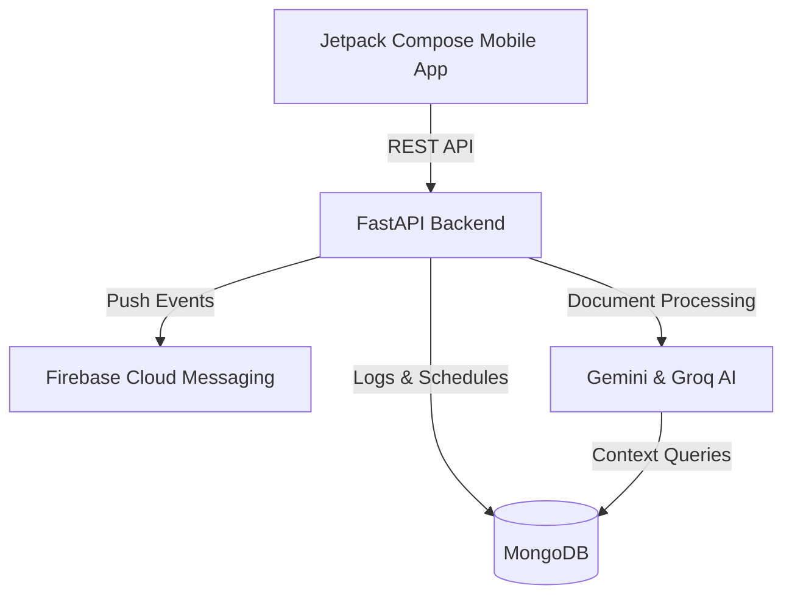

# 🏥 MediMind: AI-Powered Medication & Health Companion

  
  
  
  

MediMind is an advanced health-tech application designed to simplify medication adherence through cutting-edge AI integration. Far more than a traditional reminder app, MediMind serves as a proactive health companion, utilizing Large Language Models (LLMs) and computer vision to manage complex medication schedules and provide context-aware health guidance.

---

## 📲 Download & Install

> **Requires Android 8.0+ (API 26)**

1. **[⬇️ Download app-debug.apk](https://github.com/ganeshygadhave/MediMind/releases/latest/download/app-debug.apk)** from GitHub Releases
2. On your Android device, go to **Settings → Security → Install Unknown Apps** and allow your browser/file manager
3. Open the downloaded APK and tap **Install**

---

## 🌟 Core Innovations

### 🤖 Intelligent Health Assistant (LangGraph + Groq)
At the heart of MediMind is a sophisticated AI agent built on **LangGraph**.
- **Context-Aware**: The agent doesn't just answer questions; it queries the user's real-time medication logs and medical history to provide safe, personalized advice.
- **Structured Logic**: It uses agentic workflows to determine when to look up reports, when to cross-reference allergies, and when to provide interactive health tips.

### 📷 Smart prescription Extraction (Google Gemini AI)
MediMind eliminates manual data entry errors through AI-driven OCR.
- **One-Tap Scanning**: Users can photograph physical prescriptions or medical reports.
- **Automatic Intake**: Using Gemini 1.5 Pro, the app parses drug names, dosages, and frequencies, instantly populating the user's schedule with high accuracy.

### 🔔 Interactive Life-Cycle Notifications
The application features a "Closed-Loop" feedback system.
- **Actionable Alerts**: Notifications include "Take" and "Skip" actions that trigger background updates.
- **Dynamic Stats**: Every user action is instantly reflected in the app's dashboard statistics, providing immediate behavioral feedback.

---

## 📱 Premium User Experience

### 📊 Vitality Dashboard
A state-of-the-art interface that provides a snapshot of the user's health journey.
- **Consistency Scoring**: Proprietary algorithm that calculates adherence over a 30-day window.
- **Perfect Streaks**: Motivational tracking of consecutive days with 100% adherence.
- **Positive Health Insights**: AI-generated encouragement that adapt based on the user's real-time performance.

### 🛠️ Technical Architecture
- **Android Frontend**: Built entirely with **Jetpack Compose**, featuring a reactive, state-driven UI and a premium "Kinetic Pulse" design system.
- **Asynchronous Backend**: A modular **FastAPI** service designed for high throughput and real-time data synchronization.
- **NoSQL Persistence**: **MongoDB** integration for flexible, scalable storage of health profiles and medical history.
- **Cloud Infrastructure**: Seamlessly integrated with **Cloudinary** for medical document storage and **Firebase** for low-latency push notifications.

---

## 🏗️ Project Architecture

